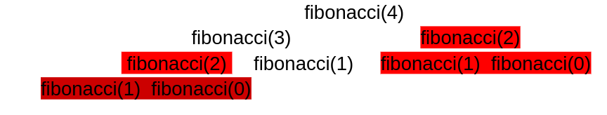

# Exercise Quadrant Health

## Problem

Part of our cryptographic mechanism (used to protect users' personal information) is based on numbers in the Fibonacci sequence. When putting our systems into production we noticed a serious performance degradation when Fibonacci numbers 100 and higher were required. Investigating, we arrive at the function that calculates it. It is transcribed below: 
function fibonacci($count){ 
  if($count == 0 || $count == 1){
 	  return 1;
  } else {
    return fibonacci($count - 1) + fibonacci($count - 2); 
  }
}


## Explanation of why this happens

The problem is that since fibonacci is a function that is executed recursively, the functions are executed several times repeatedly for a value that you have previously calculated. That is to say, when you do fibonacci(4), the results is that it ends up doing:



Observe for this simple case of a fibonacci(4) there is a whole repeating branch, which could have been optimized! This case is terribly worse in larger numbers. The larger the number, the worse the performance, since operations would be repeated every so often. It is worth mentioning that this Fibonacci recursive solution has an order of complexity of O(2^n).
A possible solution is to save the values resulting from the fibonacci calculation so as not to recalculate them, achieving an algorithm of order of complexity O(N)
There is an error in the example, according to the fibonacci sequence:
https://es.wikipedia.org/wiki/Sucesi%C3%B3n_de_Fibonacci
the value of F(0) = 0 .In the example the result would give 1.
Another error in the example, is that if $count is negative it would enter in one infinite loop.
These two errors are fixed in the api
Furthermore is considered a good option to set a maximum possible value, so  the server does not spend so much time processing or the request be cut off due to timeout. In the API I will set a maximum value of 3000.


## Setup environment with docker-compose
To build images:
```bash
docker-compose build
```
To up the project:
```bash
docker-compose up
```

then you can go to http://localhost:8080/api/documentation to see the swagger of the project

